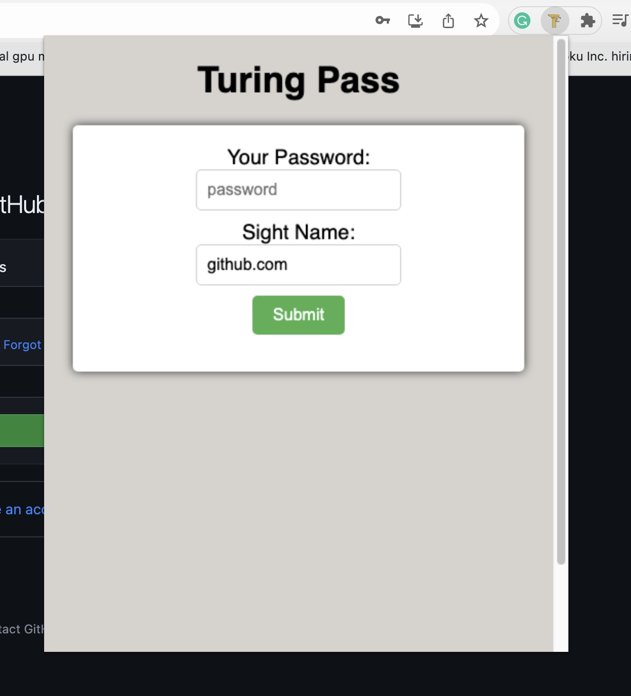
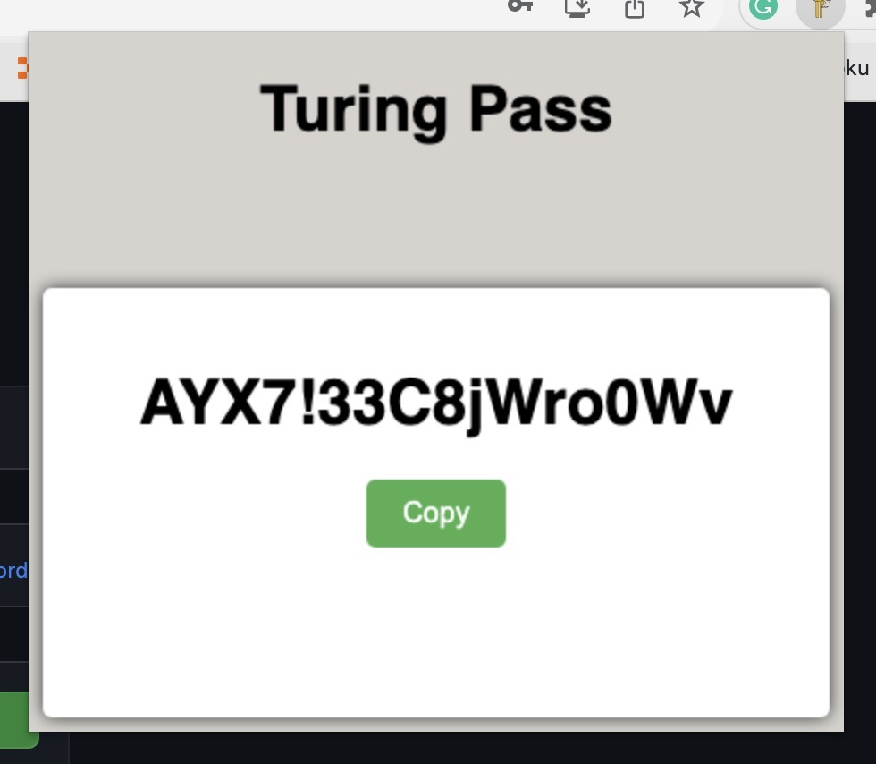

# Turing Pass
## What is turing pass?
Turing pass is a new and more secure way to manage your online passwords.
Our goal is to allow our users to enjoy the security of using strong unique passwords for every sight while still enjoying the convenience of using a single master password.

## But how?

Turing pass uses a different approach to managing passwords. Instead of us storing your passwords for each sight in our database, we use a secure hashing algorithm to create a unique password for each sight you wish to access. Simply open our easy to use chrome extension and enter your master password along with the name of the sight you wish to access, turing pass will automatically guess the name of the sight but if we get it wrong simply change the name in the "Sight Name" field then with the press of the submit button or a stroke of the "Enter" key our encryption algorithm will generate a strong and unique password for you. Then next time you wish to access that sight simply enter your master password and the sight name you used before and Turing Pass will generate the exact same password for you every time. 

    <h3>Open Turing Pass:</h3>
    
    <h3>Copy your secure password:</h3>
    

## Get Turing Pass Today!

Turing Pass is free and open source so feel free to download this repository as a zip file and load it as a custom chrome exstension in your chromium based browser. Once Turing Pass is out of beta stages we will be submitting it to the chrome store for public use. We will update this document when it has been released and will include the url to download it from the chrome store.

Use this helpful [guide](https://dev.to/ben/how-to-install-chrome-extensions-manually-from-github-1612) to download and install Truing Pass from GitHub

## Want to contribute?

Of course! Feel free to submit an issue or pull request to contribute to Turing Pass.

## more information
The back end of Turing Pass uses an API implemented in Go and is available at https://github.com/JasonBoyett/Turing-Pass-API

The code for the chrome extension is written in javascript and is available at https://github.com/JasonBoyett/Turing-Pass-CE

I plan to re-write the chrome extension using react and TypeScript and I will be implementing the ability for users to create an account for extra security features.

I would love if anyone wants to contribute to the Turing Pass Chrome Extension but I am hesitant to change the encryption algorithm in the back end. It must stay consistent so users can re-create their passwords without them being stored.